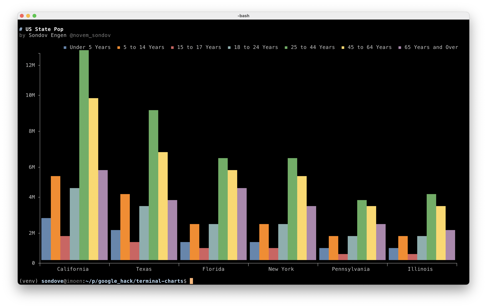
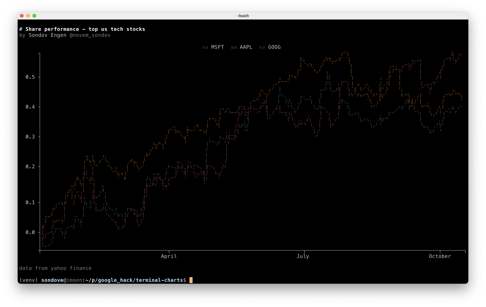
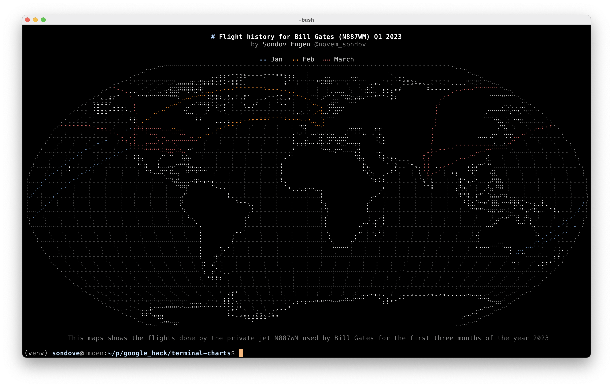

# terminal-charts
Play around with novem terminal charts

## Getting started
These examples use open data, but you need a [novem.no](https://novem.no) 
account to create the visuals.

Sign up at [novem.no](https://novem.no) or send us an e-mail at [hello@novem.no](
mailto:hello@novem.no).

## Getting the data
This folder contains two scripts, `ts` and `get_flights`. 

- `ts` is a simple python script to fetch stock prices from yahoo finance
- `get_flights` is a shell script for fetching flights from opensky


## Creating a bar chart


```bash
curl -s https://data.novem.no/v1/examples/plot/state_pop.csv | head -n 7 | novem state_pop -C -t gbar -x --fs
```


## Creating a line chart


```bash
./ts MSFT AAPL GOOG -i 0 | novem share_comp -C -t line -x --fs
```

## Creating a map chart


```bash
./get_flights.sh 2023-01-01 2023-03-31 | novem -p flights -C -t map -x --fs
```
